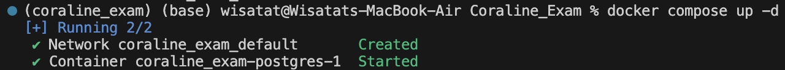
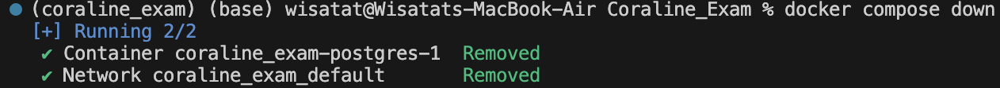
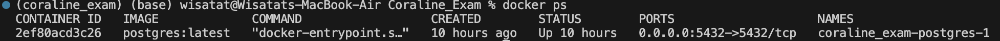
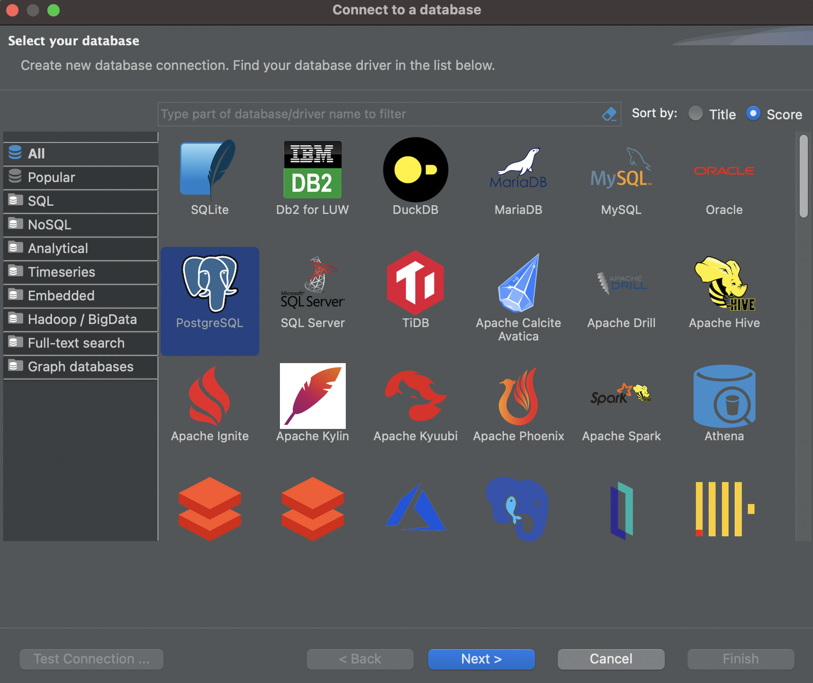
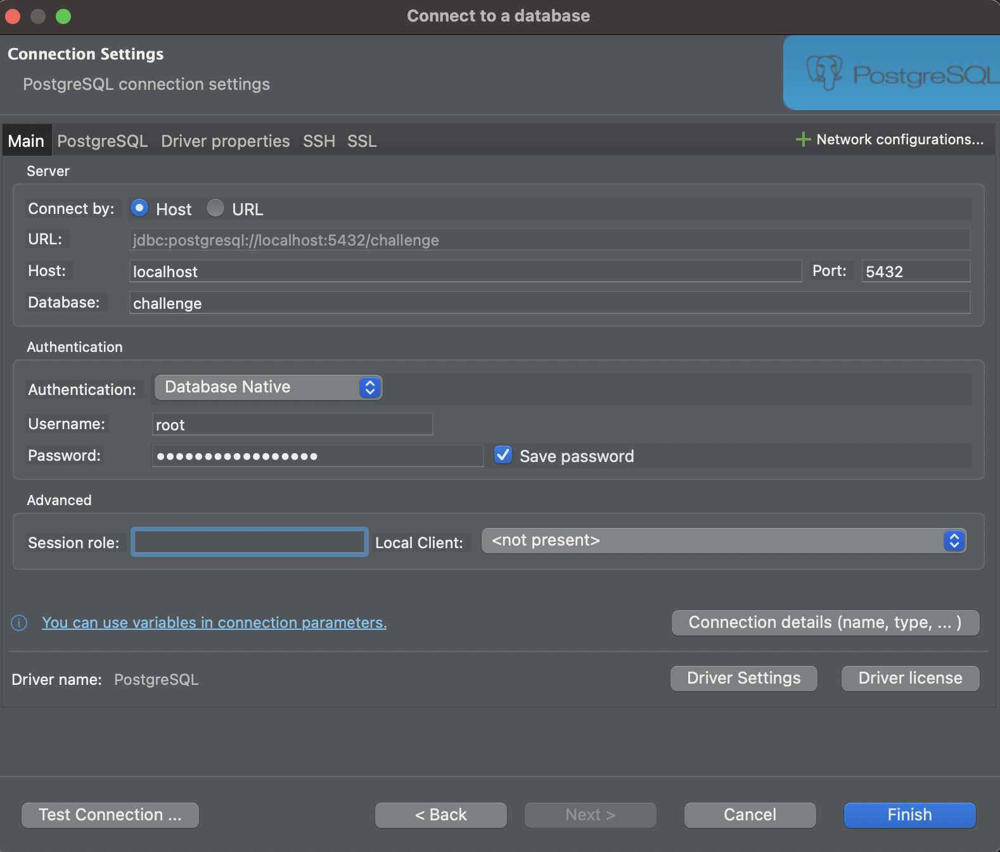
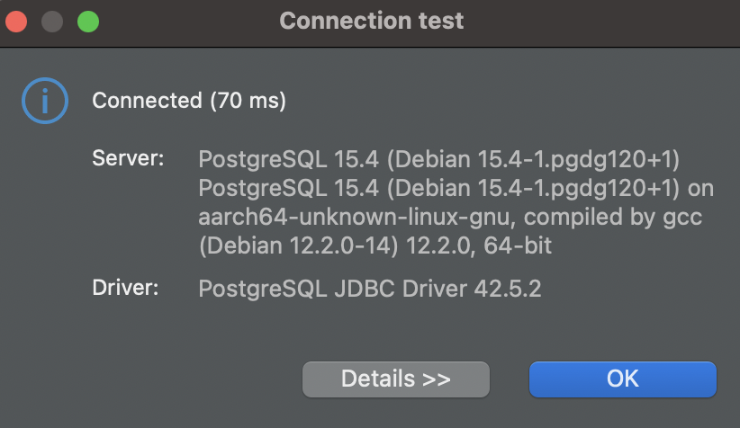
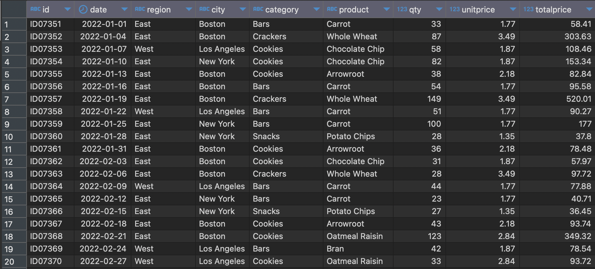
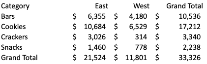
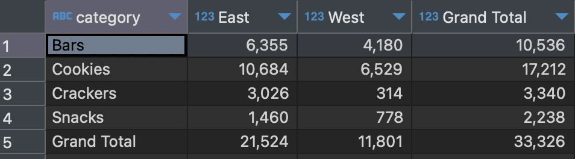
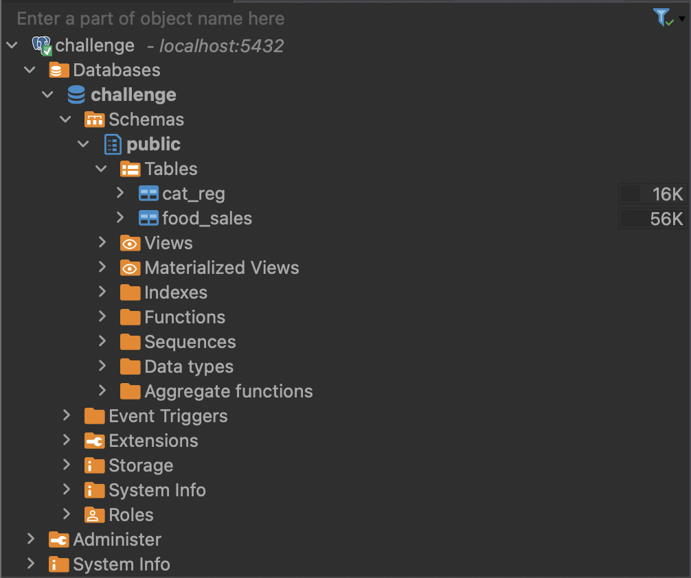

# de_challenge_docker_postgres
This project has 2 main parts which are writing python script to postgres and writing sql script to create table and generate the data as given.

We’re going to need a few things before doing this project.
- [Docker Compose](https://docs.docker.com/compose/) Simplify the process of managing multiple containers by allowing to define the configuration in a single YAML file.
- [VScode](https://code.visualstudio.com/) To run docker and script
- [DBeaver](https://dbeaver.io/) To access database and run query

### 1. Creating a PostgreSQL DB with Docker Compose and ETL .xlsx Data to PostgreSQL
#### 1.1 Initialize the Postgres Service
We will use Docker Compose to manage the instance of Postgres with `docker-compose.yaml` file:

These parameters are in `docker-compose.yaml`
| Parameter | Actual for this project | Description |
| ------ | ------ | ------ |
| POSTGRES_DB | challenge | The Postgres database name to connect **postgres** |
| POSTGRES_USER | root | The Postgres user to connect **postgres** |
| POSTGRES_PASSWORD | DataEngineer_2023 | The Postgres password to connect **postgres** |
| port | 5432:5432 | The port mapped by Postgres (local:container) local port 5432 to the port 5432 (Postgres default port) inside the container |

Run PostgreSQL in the background (adding -d Detached mode as this commmand)
```
docker-compose up -d
```


If we need to change any parammeter in `docker-compose.yaml`, we can stop PostgreSQL running with this command before change the parameter and run PostgreSQL again.
```
docker-compose down
```


If we have our container running, we can check it with this command
```
docker ps
```


After running PostgreSQL in the background in this case, I do on the DBeaver. You can look in details how to connect via DBeaver as following.
- [Connecting DBeaver PostgreSQL via PostgreSQL](https://hevodata.com/learn/dbeaver-postgresql/#Connecting_DBeaver_PostgreSQL_via_PostgreSQL_JDBC_Driver)

So here's my connection. Open DBeaver and create a new connection.

- New Database Connection
  
- Fill Host, Database, Username and Password
  
- Test Connection

  

after that click finish and we have our DBeaver connected to our docker container.

#### 1.2 Initialize the ETL Process
These processes are in `etl.py` and the operations in this file are as follows.
- Reading `de_challenge_data.xlsx`
- Renaming columns in case there is not the same
- Cleaning by drop null from merge cell or null at the beginning, and value that's column name
- Creating a connection engine using SQLAlchemy
- Defining data types and loading data to food_sales table

Remark: You can see the transformed dataframe more clearly in `sample_dataframe.ipynb` notebook

Run `etl.py` as this commmand
```
python etl.py
```


After running `etl.py` we will get the data we need in postgreSQL.


### 2. Creating a SQL Script for creating table name 'cat_reg' as given
#### You can see the result of data as given as below


These processes are in `cat_reg.sql` and the operations in this file are as follows.
- Create table name 'cat_reg'
- Pivot data by grouping category, region then sum the totalprice. After grouping by category and region, pivot the column in region values (East, West) and create the new column name = 'Grand Total' for totalprice in all region each category
- Union the Grand Total vales (we have to use union because we need to order the categoty = Grand Total in the last row)

After running `cat_reg.sql` on DBeaver, we will get the cat_reg table and data as below


### Summary for Schema and Table in this project

